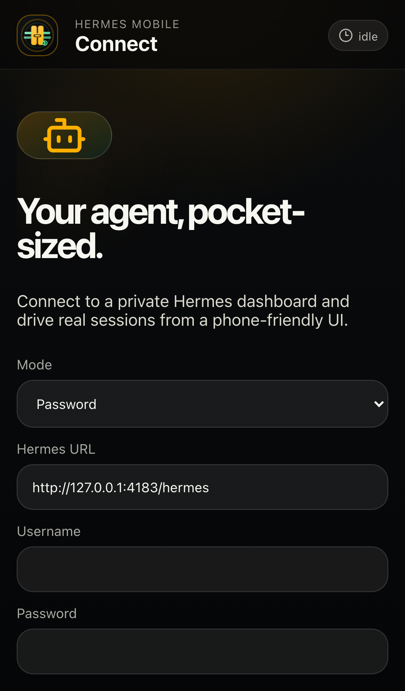
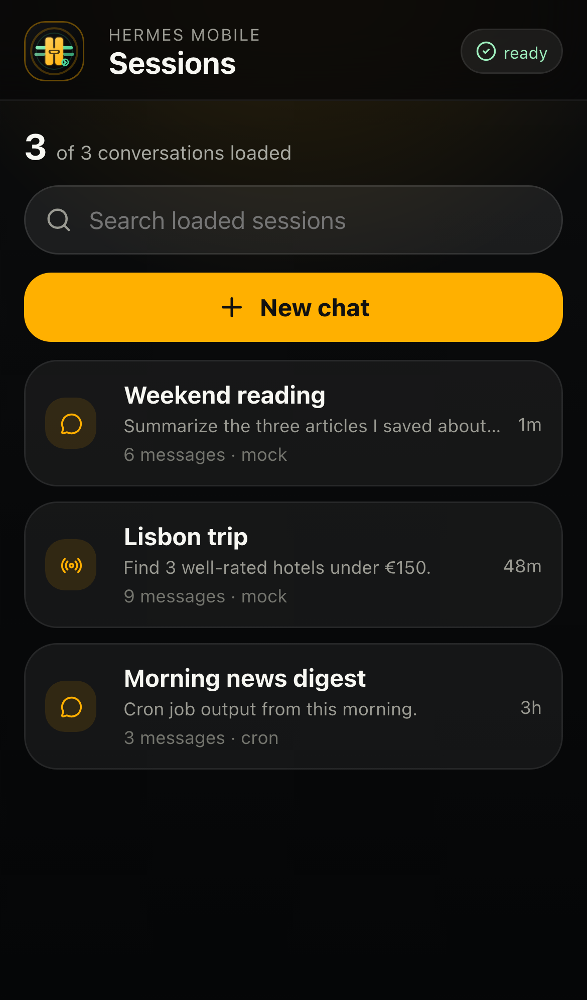
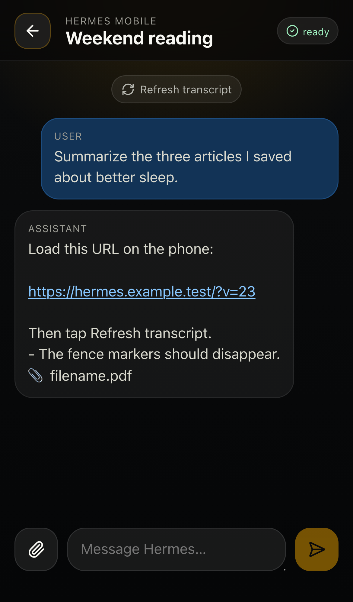

# Hermes Mobile PWA

**A phone-first, installable control surface for self-hosted [Hermes Agent](https://github.com/NousResearch/hermes-agent) dashboards.**

Hermes Mobile PWA is a lightweight React/Vite progressive web app for using Hermes from iPhone/Android browsers without Xcode, TestFlight, a native app, or a desktop-sized dashboard. It is intentionally a thin client: no agent loop, model provider key, or Hermes runtime logic runs in the browser. The app talks to a user-owned Hermes dashboard over REST plus `/api/ws` JSON-RPC.

<p>
  <a href="https://github.com/willscott-v2/hermes-mobile-pwa/blob/main/LICENSE"></a>
  
  
  
</p>

<table>
  <tr>
    <td width="33%" align="center">
      
      <br /><sub>Private dashboard login</sub>
    </td>
    <td width="33%" align="center">
      
      <br /><sub>Recent sessions</sub>
    </td>
    <td width="33%" align="center">
      
      <br /><sub>Phone-friendly chat</sub>
    </td>
  </tr>
</table>

---

## Contents

- [Why this exists](#why-this-exists)
- [What works today](#what-works-today)
- [Quick start](#quick-start)
- [Connect to a real Hermes dashboard](#connect-to-a-real-hermes-dashboard)
- [Recommended deployment](#recommended-deployment)
- [Auth model](#auth-model)
- [Mobile/PWA behavior](#mobilepwa-behavior)
- [Development scripts](#development-scripts)
- [Project layout](#project-layout)
- [Security notes](#security-notes)
- [Roadmap](#roadmap)
- [Contributing](#contributing)

---

## Why this exists

Hermes Agent is most useful when it is available where you are. The desktop dashboard is powerful, but phones need a different shape:

- a safe connection flow that does not persist passwords
- an installable app-shell with mobile safe-area handling
- recent sessions that can be resumed quickly
- a composer that does not get buried by mobile browser chrome or the software keyboard
- transcript rendering that hides internal/tool JSON while keeping real assistant output readable
- attachments from the phone: screenshots, PDFs, and files
- mock mode so contributors can build and test without a private Hermes server

Hermes Mobile PWA focuses on that phone companion use case.

## What works today

- **Installable mobile PWA shell** with app icons, manifest, and offline app-shell caching.
- **Password login flow** for Hermes dashboard auth using httpOnly cookies and WebSocket tickets.
- **Experimental token mode** for deployments that intentionally expose dashboard-compatible bearer auth.
- **Mock mode** for demos, screenshots, and contributor development with no live Hermes server.
- **Recent session list** with search and new-chat flow.
- **Live chat over `/api/ws` JSON-RPC** using `session.create`, `session.resume`, and `prompt.submit`.
- **Transcript refresh/resume hardening** for Hermes sessions that continue under latest-descendant session IDs.
- **Mobile transcript cleanup** that hides persisted tool/internal artifacts and keeps URLs clickable.
- **Attachments**: images/screenshots, PDFs, and other files route to the matching Hermes attach methods when available.
- **Automated QA**: unit tests, Playwright mobile e2e, smoke tests, public-release secret scan, and screenshot-based mobile layout checks.

## Quick start

```bash
git clone https://github.com/willscott-v2/hermes-mobile-pwa.git
cd hermes-mobile-pwa
npm install
npm run dev
```

Open:

```text
http://127.0.0.1:5178
```

For contributor/demo work, choose **Mock** mode on the connect screen. Mock mode uses local fixture data only and requires no Hermes server or credentials.

## Connect to a real Hermes dashboard

Run Hermes dashboard on a private reachable address with username/password auth enabled:

```bash
hermes dashboard --host 0.0.0.0 --port 9119 --no-open
```

Then open Hermes Mobile PWA and enter a private-network URL such as:

```text
http://<tailnet-host>:9119
```

For setup details and password reset guidance, see [`docs/AUTH_SETUP.md`](docs/AUTH_SETUP.md).

## Recommended deployment

The safest deployment is **same-origin with the Hermes dashboard** or behind a private network/VPN such as Tailscale.

Recommended patterns:

1. **Local development** — run `npm run dev` and use Mock mode.
2. **Private-network PWA** — build the static app and serve it from the same origin or a trusted reverse proxy in front of the Hermes dashboard.
3. **Path-prefixed proxy** — set `HERMES_PROXY_PREFIX` and `HERMES_DASHBOARD_TARGET` when using `scripts/tailnet-demo-server.mjs` for a local demo proxy.

Do **not** put a Hermes dashboard or this client on the open internet without a real auth boundary, TLS, rate limiting, and a deployment model you have reviewed.

## Auth model

Hermes Mobile PWA is meant to connect to the **Hermes dashboard API**, not the separate OpenAI-compatible API server.

- **Password mode** — preferred. The app posts to `/auth/password-login`; Hermes returns httpOnly cookies. Before opening `/api/ws`, the app requests a single-use `/api/auth/ws-ticket`.
- **Token mode** — experimental compatibility hook only. `API_SERVER_KEY` does **not** authenticate the dashboard `/api/sessions` + `/api/ws` routes used here.
- **Mock mode** — local demo adapter. It makes no network calls and stores no credentials.

Credential boundaries:

- Dashboard passwords are never persisted by this app.
- Non-secret connection hints may be stored locally for convenience.
- Token persistence is opt-in and should only be used on trusted devices/private networks.

## Mobile/PWA behavior

The app is designed around phone constraints rather than shrinking a desktop dashboard:

- `visualViewport`-aware layout variables for iOS Safari/PWA browser chrome and keyboard behavior.
- Fixed composer with only the message pane scrolling.
- App-shell-only service worker caching; API, auth, and WebSocket traffic are never cached.
- URL linkification after mobile text cleanup so assistant-shared links stay tappable.
- Attachment chips that show selected filenames and keep files visible until upload/send succeeds.

## Development scripts

```bash
npm run dev           # Vite dev server
npm run typecheck     # TypeScript project references
npm test              # Vitest unit tests
npm run test:e2e      # Playwright mobile Chromium tests
npm run build         # production build
npm run smoke         # verify dist app-shell files/markers
npm run scan:secrets  # public-release safety scan
npm run qa:mobile     # generate mobile screenshots + DOM metrics
```

Full local gate before pushing:

```bash
npm run typecheck \
  && npm test \
  && npm run build \
  && npm run smoke \
  && npm run scan:secrets \
  && npm run test:e2e \
  && npm run qa:mobile
```

## Project layout

```text
src/App.tsx                    # main mobile UI/state machine
src/lib/hermesApi.ts           # REST + WebSocket Hermes dashboard adapter
src/lib/jsonRpc.ts             # JSON-RPC peer helper
src/lib/mockHermes.ts          # local mock sessions/chat adapter
src/lib/mobileText.ts          # mobile transcript cleanup
src/lib/storage.ts             # non-secret local persistence helpers
public/manifest.webmanifest    # PWA metadata
public/sw.js                   # app-shell-only service worker
public/icons/                  # SVG/PNG PWA icons
scripts/scan-secrets.mjs       # public-release safety scan
scripts/mobile-ux-qa.mjs       # mobile screenshot/DOM QA
scripts/tailnet-demo-server.mjs # optional static + proxy demo server
docs/                          # architecture/auth/contributor docs
```

## Security notes

Hermes Mobile PWA controls a user's self-hosted agent. Treat it like a remote shell control surface.

- Keep deployments private-network-first unless you have reviewed the full auth/proxy boundary.
- Do not commit real Hermes URLs, session IDs from private systems, tokens, screenshots with personal data, `.env` files, or local Hermes state.
- Server responses and chat content are untrusted data.
- Do not render assistant/tool/user content with raw HTML injection.
- The service worker intentionally bypasses `/api/`, `/auth/`, and non-GET requests.

See [`SECURITY.md`](SECURITY.md) and [`PUBLIC_RELEASE_AUDIT.md`](PUBLIC_RELEASE_AUDIT.md).

## Roadmap

Good next issues for contributors:

- richer Markdown/code rendering with a reviewed sanitizer
- approve/deny and clarify cards wired to real pending-input frames
- stronger attachment progress/error UI
- slash command palette
- profile switcher
- cron job views/controls
- Web Push where browser support and deployment constraints allow it
- optional OIDC/OAuth deployment guide for internet-facing installs

## Contributing

Contributions are welcome, especially from people running Hermes on phones or private homelab/Tailscale setups.

Start here:

1. Use Mock mode to reproduce UI behavior without private infrastructure.
2. Add or update tests for visible mobile behavior.
3. Run the full local gate above.
4. Keep screenshots, fixture URLs, and docs public-safe.
5. Open a PR with screenshots or a short screen recording for UI changes.

See [`CONTRIBUTING.md`](CONTRIBUTING.md) for the maintainer workflow and public-release rules.
